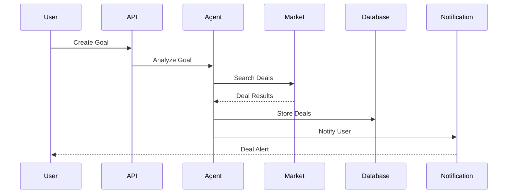
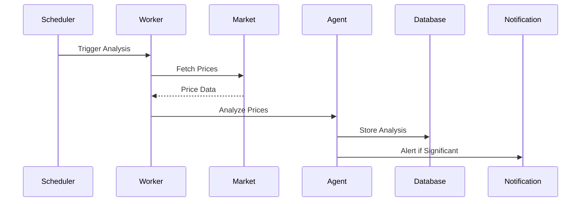
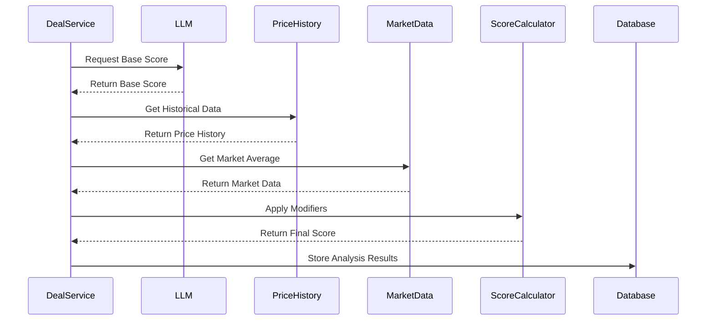

# System Architecture

## Overview
The AI Agentic Deals System is built using a modern, scalable microservices architecture. The system is designed to handle high-throughput deal processing, real-time notifications, and AI-driven analysis while maintaining high availability and fault tolerance.

## Architecture Diagram
```
┌─────────────────┐     ┌─────────────────┐     ┌─────────────────┐
│   Client Apps   │     │     Frontend     │     │   API Gateway   │
│  Web / Mobile   │────▶│    Next.js 14    │────▶│    FastAPI     │
└─────────────────┘     └─────────────────┘     └────────┬────────┘
                                                         │
                                                         ▼
┌─────────────────┐     ┌─────────────────┐     ┌─────────────────┐
│  Redis Cache    │◀───▶│  Core Services  │◀───▶│   PostgreSQL    │
│   In-Memory     │     │    FastAPI      │     │    Database     │
└─────────────────┘     └────────┬────────┘     └─────────────────┘
                                 │
                        ┌────────┴────────┐
                        │                 │
                 ┌──────▼─────┐    ┌─────▼──────┐
                 │   Celery   │    │    Agent   │
                 │  Workers   │    │   System   │
                 └──────┬─────┘    └─────┬──────┘
                        │                │
                 ┌──────▼────────────────▼──────┐
                 │      External Services       │
                 │  Markets, LLMs, Blockchain  │
                 └───────────────────────────────┘
```

## Core Components

### 1. Frontend Layer
- **Technology**: Next.js 14+
- **Purpose**: User interface and client-side logic
- **Features**:
  - Server-side rendering
  - Real-time updates via WebSocket
  - Responsive design
  - Client-side caching

### 2. API Gateway
- **Technology**: FastAPI
- **Purpose**: Request routing and API management
- **Features**:
  - Authentication
  - Rate limiting
  - Request validation
  - Response caching

### 3. Core Services
- **Technology**: FastAPI
- **Purpose**: Business logic and data processing
- **Services**:
  ```python
  services = {
      "user": UserService,
      "goal": GoalService,
      "deal": DealService,
      "token": TokenService,
      "notification": NotificationService
  }
  ```

### 4. Database Layer
- **Technology**: PostgreSQL 15+
- **Purpose**: Persistent data storage
- **Features**:
  - ACID compliance
  - JSON/JSONB support
  - Full-text search
  - Partitioning

### 5. Cache Layer
- **Technology**: Redis
- **Purpose**: In-memory caching and session storage
- **Features**:
  - Session management
  - Rate limiting
  - Real-time data
  - Pub/Sub messaging

### 6. Background Processing
- **Technology**: Celery
- **Purpose**: Asynchronous task processing
- **Features**:
  - Task scheduling
  - Retry mechanisms
  - Result backend
  - Task monitoring

### 7. Agent System
- **Technology**: LangChain
- **Purpose**: AI-driven deal analysis
- **Components**:
  - Goal Analysis Agent
  - Deal Search Agent
  - Price Analysis Agent
  - Notification Agent

## Service Communication

### 1. Synchronous Communication
```python
# HTTP/REST API
@router.post("/goals/{goal_id}/deals")
async def create_deal(
    goal_id: UUID,
    deal: DealCreate,
    user: User = Depends(get_current_user)
) -> Deal:
    return await deal_service.create_deal(user, goal_id, deal)
```

### 2. Asynchronous Communication
```python
# Celery Task
@celery_app.task
def analyze_deal(deal_id: str):
    deal = Deal.get(deal_id)
    analysis = agent_system.analyze_deal(deal)
    notify_user(deal.user_id, analysis)
```

### 3. Event-Driven Communication
```python
# WebSocket Events
async def handle_deal_update(deal: Deal):
    message = {
        "type": "deal_update",
        "data": deal.dict()
    }
    await websocket_manager.broadcast(message)
```

## Data Flow

### 1. Deal Discovery Flow


### 2. Price Analysis Flow


### 3. Deal Analysis and Scoring

The AI Agentic Deals System employs a sophisticated approach to deal analysis and scoring, providing users with valuable insights beyond simple price comparisons.

#### Analysis Process Flow


#### Scoring Components

The deal scoring system uses a multi-factor approach:

```python
# Scoring Formula
SCORING_FORMULA = {
    "base_score": "LLM-generated score (0-100)",
    "price_trend_modifier": "+5 for falling, -5 for rising, 0 for stable",
    "source_reliability_modifier": "(reliability - 0.8) * 10",
    "discount_modifier": "+10 for >50% discount, +7 for >30%, +5 for >20%, +3 for >10%",
    "competitiveness_modifier": "+10 if price < 80% of market avg, +5 if < 90%, -5 if > 110%"
}

# Final Score Calculation
final_score = base_score + price_trend_modifier + source_reliability_modifier + 
              discount_modifier + competitiveness_modifier

# Normalized for Storage
normalized_score = final_score / 100.0
```

#### Statistical Analysis

The system employs statistical methods to validate scores and detect anomalies:

```python
# Statistical Metrics
STATISTICAL_ANALYSIS = {
    "moving_average": "Average of last 5 scores",
    "standard_deviation": "sqrt(sum((x - mean)^2) / (n - 1))",
    "anomaly_threshold": "2 * standard_deviation",
    "price_stability": "1 - (standard_deviation / average_price)"
}

# Anomaly Detection
is_anomaly = abs(score - moving_average) > (2 * standard_deviation)
```

#### Source Reliability

Source reliability is pre-calibrated for known marketplaces:

```python
# Source Reliability Scores
SOURCE_RELIABILITY = {
    "amazon": 0.95,
    "walmart": 0.90,
    "bestbuy": 0.85,
    "target": 0.85,
    "ebay": 0.75,
    "other": 0.60
}
```

#### Caching Strategy

Different types of analysis data are cached with different TTLs:

```python
# Analysis Cache TTLs
ANALYSIS_CACHE_TTL = {
    "basic_deal_info": 7200,  # 2 hours
    "full_deal_data": 3600,   # 1 hour
    "price_history": 86400,   # 24 hours
    "search_results": 600     # 10 minutes
}
```

## Scalability

### 1. Horizontal Scaling
```yaml
# Docker Swarm Configuration
services:
  api:
    image: deals-api
    deploy:
      replicas: 3
      resources:
        limits:
          cpus: '0.5'
          memory: 512M
      restart_policy:
        condition: on-failure
```

### 2. Database Scaling
```python
# Database Connection Pool
DATABASE_CONFIG = {
    "pool_size": 20,
    "max_overflow": 10,
    "pool_timeout": 30,
    "pool_recycle": 1800
}
```

### 3. Cache Scaling
```python
# Redis Cluster Configuration
REDIS_CONFIG = {
    "cluster_nodes": [
        {"host": "redis-1", "port": 6379},
        {"host": "redis-2", "port": 6379},
        {"host": "redis-3", "port": 6379}
    ],
    "read_replicas": True
}
```

## High Availability

### 1. Service Redundancy
```yaml
# Kubernetes Deployment
apiVersion: apps/v1
kind: Deployment
metadata:
  name: deals-api
spec:
  replicas: 3
  selector:
    matchLabels:
      app: deals-api
  template:
    metadata:
      labels:
        app: deals-api
    spec:
      containers:
      - name: deals-api
        image: deals-api:latest
        ports:
        - containerPort: 8000
```

### 2. Database Redundancy
```python
# Database Failover Configuration
DATABASE_FAILOVER = {
    "primary": "postgresql://primary:5432/deals",
    "replica": "postgresql://replica:5432/deals",
    "automatic_failover": True,
    "failover_timeout": 30
}
```

### 3. Load Balancing
```nginx
# Nginx Load Balancer Configuration
upstream api_servers {
    server api1:8000;
    server api2:8000;
    server api3:8000;
    keepalive 32;
}

server {
    listen 80;
    location / {
        proxy_pass http://api_servers;
        proxy_set_header Host $host;
        proxy_set_header X-Real-IP $remote_addr;
    }
}
```

## Security

### 1. Authentication
```python
# JWT Authentication
SECURITY_CONFIG = {
    "algorithm": "HS256",
    "access_token_expire_minutes": 30,
    "refresh_token_expire_days": 7,
    "password_hashing": "bcrypt"
}
```

### 2. Authorization
```python
# Role-Based Access Control
RBAC_CONFIG = {
    "roles": ["user", "admin", "service"],
    "permissions": {
        "user": ["read", "create", "update"],
        "admin": ["read", "create", "update", "delete"],
        "service": ["read", "create"]
    }
}
```

### 3. Network Security
```yaml
# Network Policy
apiVersion: networking.k8s.io/v1
kind: NetworkPolicy
metadata:
  name: api-network-policy
spec:
  podSelector:
    matchLabels:
      app: deals-api
  ingress:
  - from:
    - podSelector:
        matchLabels:
          app: frontend
    ports:
    - protocol: TCP
      port: 8000
```

## Monitoring

### 1. Metrics Collection
```python
# Prometheus Metrics
METRICS_CONFIG = {
    "collectors": [
        "request_latency",
        "error_rate",
        "active_users",
        "deal_count",
        "system_resources"
    ],
    "export_port": 9090,
    "scrape_interval": "15s"
}
```

### 2. Logging
```python
# Logging Configuration
LOGGING_CONFIG = {
    "version": 1,
    "handlers": {
        "console": {
            "class": "logging.StreamHandler",
            "level": "INFO"
        },
        "file": {
            "class": "logging.handlers.RotatingFileHandler",
            "filename": "app.log",
            "maxBytes": 10485760,
            "backupCount": 5
        }
    }
}
```

### 3. Alerting
```yaml
# Alert Rules
groups:
- name: deals_alerts
  rules:
  - alert: HighErrorRate
    expr: error_rate > 0.1
    for: 5m
    labels:
      severity: critical
    annotations:
      description: Error rate exceeded 10%
```

## Deployment

### 1. Container Orchestration
```yaml
# Docker Compose Configuration
version: '3.8'
services:
  api:
    build: ./backend
    environment:
      - DATABASE_URL=postgresql://deals_postgres:5432/deals
      - REDIS_URL=redis://deals_redis:6379/0
    depends_on:
      - postgres
      - redis
  
  worker:
    build: ./backend
    command: celery -A app worker
    depends_on:
      - redis
      - api
  
  frontend:
    build: ./frontend
    ports:
      - "3000:3000"
    depends_on:
      - api
```

### 2. CI/CD Pipeline
```yaml
# GitHub Actions Workflow
name: CI/CD
on:
  push:
    branches: [ main ]
jobs:
  test:
    runs-on: ubuntu-latest
    steps:
      - uses: actions/checkout@v2
      - name: Run tests
        run: |
          pip install -r requirements.txt
          pytest
  
  deploy:
    needs: test
    runs-on: ubuntu-latest
    steps:
      - name: Deploy to production
        run: |
          docker-compose -f docker-compose.prod.yml up -d
```

## Performance Optimization

### 1. Caching Strategy
```python
# Cache Configuration
CACHE_CONFIG = {
    "default_ttl": 300,
    "patterns": {
        "user:*": 3600,
        "deal:*": 60,
        "market:*": 300
    },
    "max_memory": "1gb"
}
```

### 2. Database Optimization
```python
# Query Optimization
DATABASE_OPTIMIZATIONS = {
    "pool_size": 20,
    "statement_timeout": 1000,
    "idle_in_transaction_session_timeout": 600,
    "effective_cache_size": "4GB",
    "work_mem": "64MB"
}
```

### 3. Load Testing
```python
# Locust Load Test Configuration
LOAD_TEST_CONFIG = {
    "users": 1000,
    "spawn_rate": 10,
    "host": "http://api:8000",
    "run_time": "1h",
    "scenarios": [
        "search_deals",
        "create_goal",
        "track_price"
    ]
}
```

## Best Practices

### 1. Code Organization
- Follow domain-driven design
- Use clean architecture principles
- Implement proper error handling
- Maintain comprehensive documentation

### 2. Development Workflow
- Use feature branches
- Implement code review process
- Maintain test coverage
- Follow semantic versioning

### 3. Operations
- Monitor system health
- Implement proper logging
- Maintain backup strategy
- Plan for disaster recovery 